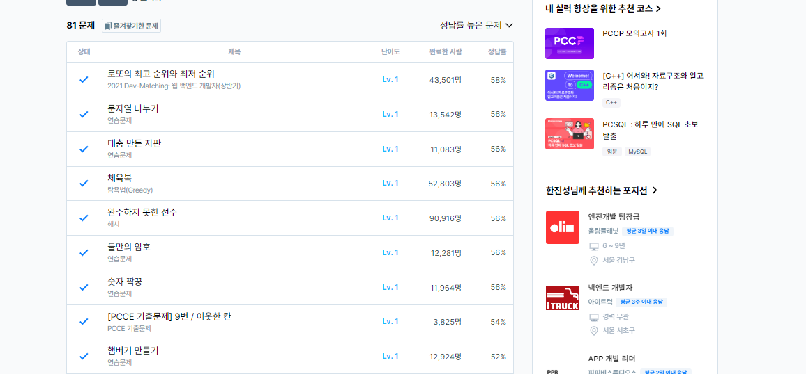

# 12일차

프로그래머스 LV1 풀이 (page4 1/2)

### 대충 만든 자판
[대충 만든 자판](https://school.programmers.co.kr/learn/courses/30/lessons/160586)
```
#include <string>
#include <vector>

using namespace std;

vector<int> solution(vector<string> keymap, vector<string> targets) {
    vector<int> answer;
    
    for(int i=0,n=targets.size();i<n;i++){
        int sum = 0;
        for(int j=0,s=targets[i].size();j<s;j++){
            int min = 9999999;
            for(int k=0,p=keymap.size();k<p;k++){
                int count = 0;
                for(int l=0,o=keymap[k].size();l<o;l++){
                    if(targets[i][j] == keymap[k][l]){
                        count = l+1;
                        break;
                    }
                }
                if(count != 0 && min > count){
                    min = count;
                }
            }
            
            sum = sum + min;
        }
        if(sum >= 9999999){
            answer.push_back(-1);
        }else{
            answer.push_back(sum);
        }
    }
    
    return answer;
}
```
타겟 문자열을 키 배열을 탐색하며 가장 가까운 문자를 확인해 그 카운트 횟수를 누적시키는 방법으로 풀이했다. 찾으려는 문자가 없는 경우, -1을 추가하도록 했다.

### 숫자 짝꿍
[숫자 짝꿍](https://school.programmers.co.kr/learn/courses/30/lessons/131128);
```
#include <string>
#include <vector>
#include <algorithm>

using namespace std;

string solution(string X, string Y) {
    string answer = "";
    
    sort(X.begin(), X.end());
    sort(Y.begin(), Y.end());
    
    int count1[10] = {0};
    int count2[10] = {0};
    
    for(int i=0,n=X.size();i<n;i++){
        
        count1[X[i]-'0']++;
        
    }
    
    for(int i=0,n=Y.size();i<n;i++){
        count2[Y[i]-'0']++;
    }
    
    for(int i=9;i>=0;i--){
        
        while(true){
            
            if(count1[i] == 0 || count2[i] == 0){
                break;
            }
            
            answer += (char)(i+'0');
            count1[i]--;
            count2[i]--;
        }
        
    }
    if(answer == ""){
        answer = "-1";
    }else if(answer[0] == '0'){
        int ans = stoi(answer);
        answer = to_string(ans);
    }
    return answer;
}
```

두 문자열에서 공통된 숫자를 모아 가장 큰 수를 만들어내는 문제, 제한사항에서 문자열 길이가 300만으로, 시간복잡도에 대한 고려가 많이 필요한 문제였다.




