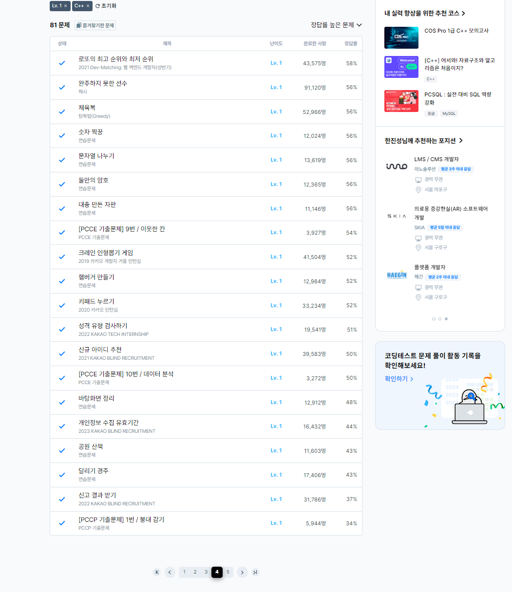

# 13일차

프로그래머스 LV1 풀이 (page4, 5(1문제))

### 데이터 분석
[데이터 분석](https://school.programmers.co.kr/learn/courses/30/lessons/250121)
```
#include <string>
#include <vector>
#include <algorithm>

using namespace std;

string _sort;
bool compare(vector<int> a, vector<int> b){
        
    if(_sort == "code"){        
        if(a[0] < b[0]){
            return true;
        }else{
            return false;
        }
    }else if(_sort == "date"){
        
        if(a[1] < b[1]){
            return true;
        }else{
            return false;
        }
    }else if(_sort == "maximum"){
        if(a[2] < b[2]){
            return true;
        }else{
            return false;
        }
    }else{
        if(a[3] < b[3]){
            return true;
        }else{
            return false;
        }
    }
}       

vector<vector<int>> solution(vector<vector<int>> data, string ext, int val_ext, string sort_by) {
    vector<vector<int>> answer;
    _sort = sort_by;
    int num = -1;
    
    if(ext == "code"){
        num = 0;
    }else if(ext == "date"){
        num = 1;
    }else if(ext == "maximum"){
        num = 2;
    }else if(ext == "remain"){
        num = 3;
    }
    
    for(int i=data.size()-1;i>=0;i--){
        if(data[i][num] > val_ext){
            data.erase(data.begin()+i);
        }
    }
    
    sort(data.begin(),data.end(),compare);
    
    
    return data;
}
```
정렬과 관련된 문제, C++에서 비교 알고리즘을 이용하여 정렬할 경우, 인자값은 비교할 대상 2개로 고정되어야 했기에 정렬요소를 결정하는 문자열을 전역변수로 꺼내 체크하였다.

### 신고 결과 받기
[신고 결과 받기](https://school.programmers.co.kr/learn/courses/30/lessons/92334)
```
#include <string>
#include <vector>
#include <map>
#include <set>
#include <sstream>
#include <iostream>
using namespace std;

vector<int> solution(vector<string> id_list, vector<string> report, int k) {
    vector<int> answer(id_list.size(),0);
    
    // 내가 신고한 사람은 set에 추가, 중복은 자동으로 추가안됨.
    map<string,map<string,int>> user;
    
    // 신고된 사람은 신고한 사람을 기준으로 map에 추가됨. 중복 신고는 자동으로 컷 됨
    map<string,map<string,int>>  repo;
    
    for(int i=0,n=report.size();i<n;i++){
        stringstream ss(report[i]);
        
        string user1;
        string user2;
        getline(ss,user1,' ');
        getline(ss,user2,' ');
        
        user[user1][user2] = 1;
        repo[user2][user1] = 1;
    }
    
    for(int i=0,n=id_list.size();i<n;i++){
        
        if(repo[id_list[i]].size() >= k){
            
            for(int j=0;j<n;j++){
                if(user[id_list[j]][id_list[i]] == 1){
                    answer[j]++;
                }
            }
            
        }
        
    }
    
    return answer;
}
```
중복에 대한 처리와, 카운팅을 어떻게 하는 지에 따라 효율성에서 탈락할 수도 있었던 문제, C++에서는 map을 이용하면 배열처럼 접근할 수 있어 편리하게 풀이할 수 있었다. Java였다면 코드가 상당히 지저분해 졌을 것이라 생각한다.

### 붕대 감기
[붕대 감기](https://school.programmers.co.kr/learn/courses/30/lessons/250137);
```
#include <string>
#include <vector>
#include <iostream>
using namespace std;

int solution(vector<int> bandage, int health, vector<vector<int>> attacks) {
    
    int maxHealCount = bandage[0];
    int heal = bandage[1];
    int maxHeal = bandage[2]; 
    int maxHp = health;
    int attackCount = 0;
    int healCount = 0;
    
    
    for(int i=0,n=attacks[attacks.size()-1][0];i<=n;i++){
        if(attacks[attackCount][0] == i){
            health -= attacks[attackCount][1];
            attackCount++;
            healCount = 0;
            if(health <= 0){
                return -1;
            }
            continue;
        }
        
        health += heal;
        healCount++;
        
        if(healCount == maxHealCount){
            healCount = 0;
            health += maxHeal;
        }
        if(health > maxHp){
            health = maxHp;
        }
        
    }
    
    
    return health;
}
```

게임 형식의 시뮬레이션 문제, 주어진 조건대로 코드를 차근차근 구현하였다.




