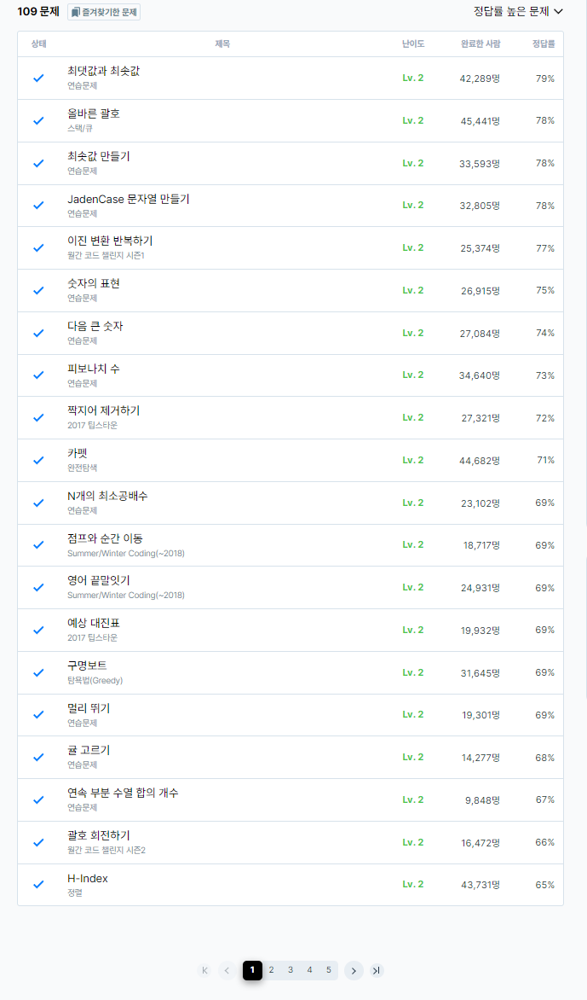

# 14일차

프로그래머스 LV2 풀이 (page 1)

### 올바른 괄호
[올바른 괄호](https://school.programmers.co.kr/learn/courses/30/lessons/12909)
```
#include <string>
#include <iostream>
#include <stack>
using namespace std;

bool solution(string s)
{
    bool answer = true;

    stack<char> stack;
        
    for(int i=0,n=s.size();i<n;i++){
        if(s[i] == '('){
            stack.push(s[i]);
        }else{
            if(stack.empty()){
                answer = false;
                break;
            }else{
                stack.pop();
            }
        }
    }
    if(!stack.empty()){
        answer = false;
    }
    return answer;
}
```
스택을 이용하여 닫힌 괄호를 체크하는 간단한 문제였다.

### 예상 대진표
[예상 대진표](https://school.programmers.co.kr/learn/courses/30/lessons/12985)
```
#include <iostream>

using namespace std;

int solution(int n, int a, int b)
{
    int answer = 0;
    while(true){
        
        if(a%2 == 0){
            a = a/2;
        }else{
            a = a/2+1;
        }
        if(b%2 == 0){
            b = b/2;
        }else{
            b = b/2+1;
        }
        answer++;
        if(a == b){
            break;
        }
        
        
    }
    return answer;

}
```

순차적으로 나눠가면서 카운팅하는 문제였다.



