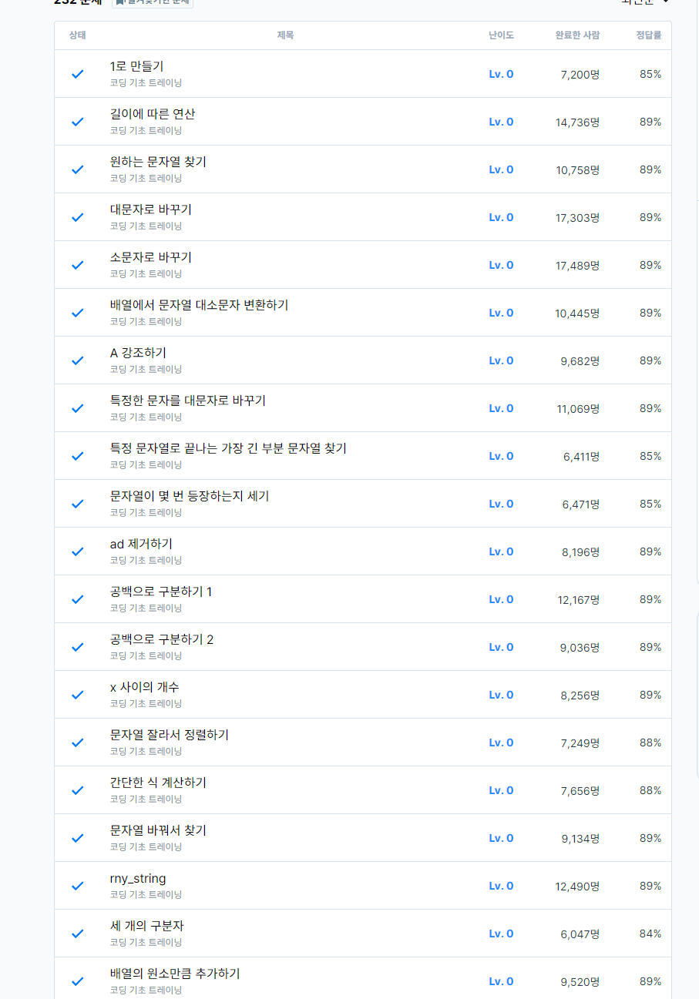

# 2일차

프로그래머스 LV0 풀이 (page5)
  
### 세 개의  구분자     
[세 개의 구분자](https://school.programmers.co.kr/learn/courses/30/lessons/181862)
```
#include <string>
#include <vector>
#include <sstream>
using namespace std;

vector<string> solution(string myStr) {
    vector<string> temp1;
    vector<string> temp2;
    vector<string> answer;
    
    stringstream ss(myStr);
    
    string word;
    
    while(getline(ss,word,'a')){
        if(word != ""){
            temp1.push_back(word);
        }
    }
    
    for(int i=0,n=temp1.size();i<n;i++){
        
        stringstream ss2(temp1[i]);
        
        while(getline(ss2,word,'b')){
            if(word != ""){
                temp2.push_back(word);
            }
        }
        
    }
    
    for(int i=0,n=temp2.size();i<n;i++){
        
        stringstream ss3(temp2[i]);
        
        while(getline(ss3,word,'c')){
            if(word != ""){
                answer.push_back(word);
            }
        }
    }
    
    if(answer.size() == 0){
        answer.push_back("EMPTY");
    }
    
    return answer;
}
```

C++에서의 문자열 구분 라이브러리, sstream을 실습해볼 수 있었던 문제. 'a','b','c'로 각각 구분하여 주면서 결과 값을 저장하였다.

