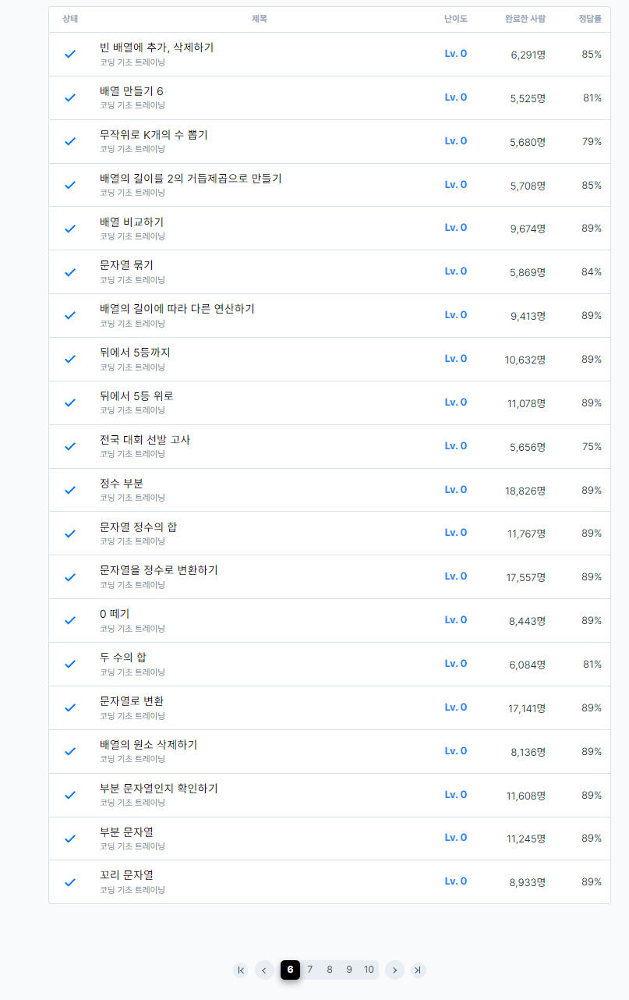

# 3일차

프로그래머스 LV0 풀이 (page6)
  
### 배열의 길이를 2의 거듭제곱으로 만들기    
[배열의 길이를 2의 거듭제곱으로](https://school.programmers.co.kr/learn/courses/30/lessons/181857)
```
#include <string>
#include <vector>
#include <iostream>
using namespace std;

vector<int> solution(vector<int> arr) {
    
    int size = arr.size();    
    
    while(size&(size-1)){
        size++;
    }
    arr.resize(size,0);
    return arr;
}
```

2의 거듭제곱을 확인하는 방법 중에 &연산을 활용하는 방법도 있다. 

2진수로 변환할 때 2의 거듭제곱수와 그 수에서 1을 뺀 값을 서로 AND 연산하면 그 값은 0이 되는 것을 이용한 것이다.


### 두 수의 합
[두 수의 합](https://school.programmers.co.kr/learn/courses/30/lessons/181846)
```
#include <string>
#include <vector>
#include <iostream>
#include <algorithm>
using namespace std;

string solution(string a, string b) {
    string answer = "";
    while(a.size() != b.size()){
        if(a.size() > b.size()){
            b = "0" + b;
        }else if( a.size() < b.size()){
            a = "0" + a;
        }
    }
    int carry = 0;
    for(int i=a.size()-1;i>=0;i--){
        
        int ax = a[i] - '0';
        int bx = b[i] - '0';

        if((ax + bx + carry) >= 10){
            answer += to_string((ax+bx+carry)%10);
            carry = 1;
        }else{
            answer += to_string((ax+bx+carry)%10);
            carry = 0;
        }
    }
    if(carry == 1){
        answer += "1";
    }
    
    reverse(answer.begin(), answer.end());

    
    return answer;
}
```
범위를 벗어나는 큰 수의 합을 통해 덧셈의 기본을 생각하게 되었던 문제, 기본적으로 각 자리수를 더하고 올림수를 추가하는 방식으로 계산하면 어떤 큰 수라도 덧셈을 계산할 수 있다.

