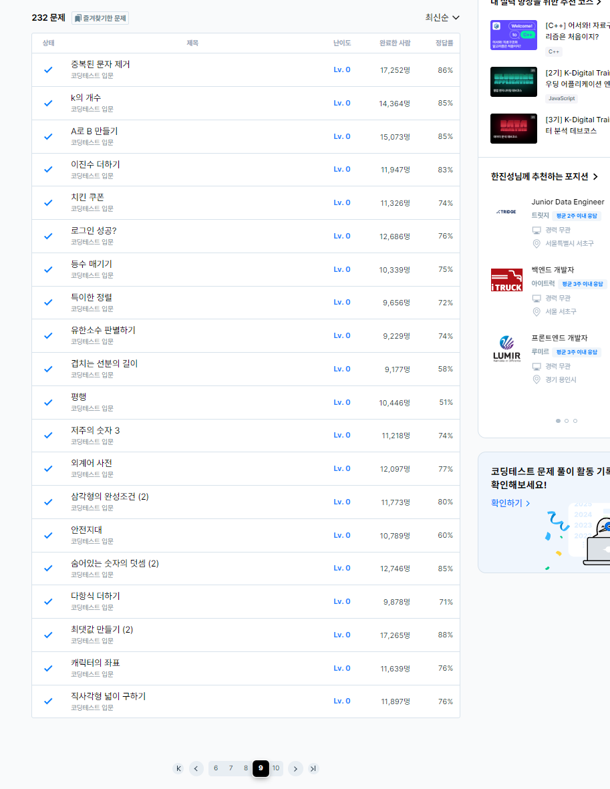

# 7일차

프로그래머스 LV0 풀이 (page9)


### 평행
[평행](https://school.programmers.co.kr/learn/courses/30/lessons/120875)
```
#include <string>
#include <vector>
#include <iostream>
using namespace std;
int isParallel(vector<int> dots1, vector<int> dots2, vector<int> dots3, vector<int> dots4);
int gcd(int a, int b);
int solution(vector<vector<int>> dots) {
    int answer = 0;
    
    answer += isParallel(dots[0], dots[1], dots[2], dots[3]);
    answer += isParallel(dots[1], dots[2], dots[3], dots[0]);
    answer += isParallel(dots[0], dots[3], dots[1], dots[2]);
    if(answer > 1){
        answer = 1;
    }
    return answer;
}

int isParallel(vector<int> dots1, vector<int> dots2, vector<int> dots3, vector<int> dots4){
    
    int num1 = dots1[0] - dots2[0];
    int num2 = dots1[1] - dots2[1];
    int gcd1 = gcd(num1,num2);
    int num3 = dots3[0] - dots4[0];
    int num4 = dots3[1] - dots4[1];
    int gcd2 = gcd(num3,num4);
    num1 = num1/gcd1;
    num2 = num2/gcd1;
    num3 = num3/gcd2;
    num4 = num4/gcd2;
    
    if(num1==num3 && num2 == num4){
        return 1;
    }else{
        return 0;
    }
}

int gcd(int a, int b){
    if(b == 0){
        return a;
    }else{
        return gcd(b, a%b);
    }
}
```
점 4개가 주어졌을 때, 두 직선이 평행한 지 체크하는 문제이다.

프로그래밍에서는 부동소수점 문제로 정확한 나눗셈 계산이 불가능 하므로, 기울기를 계산한 결과(분수 형태)를 기약분수 형태로 나타내어(분자와 분모의 최대공약수로 각각 나누어주기) 두 직선의 기울기가 같은지 비교하는 방식으로 풀었다.

