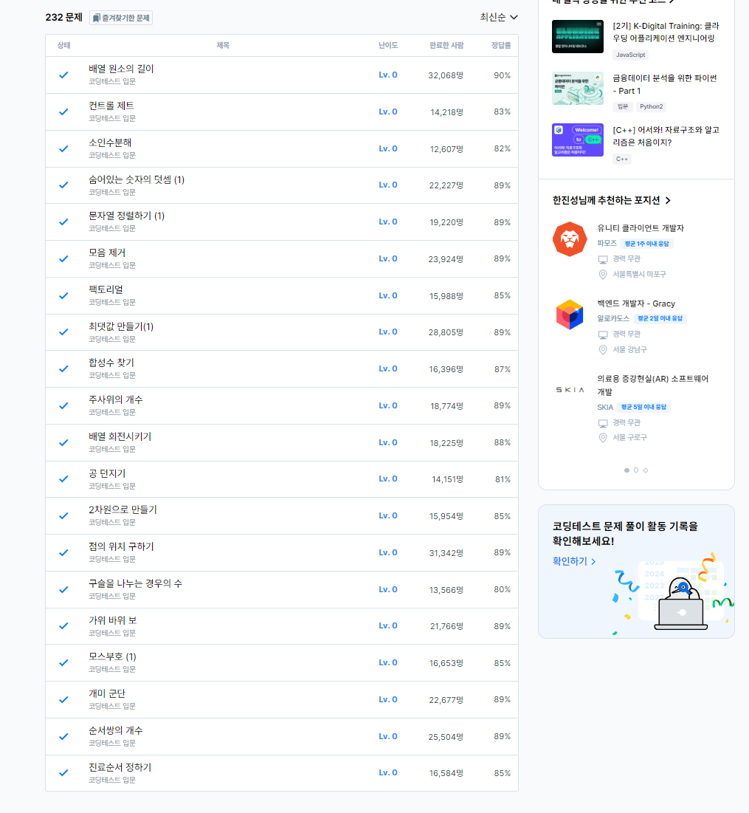
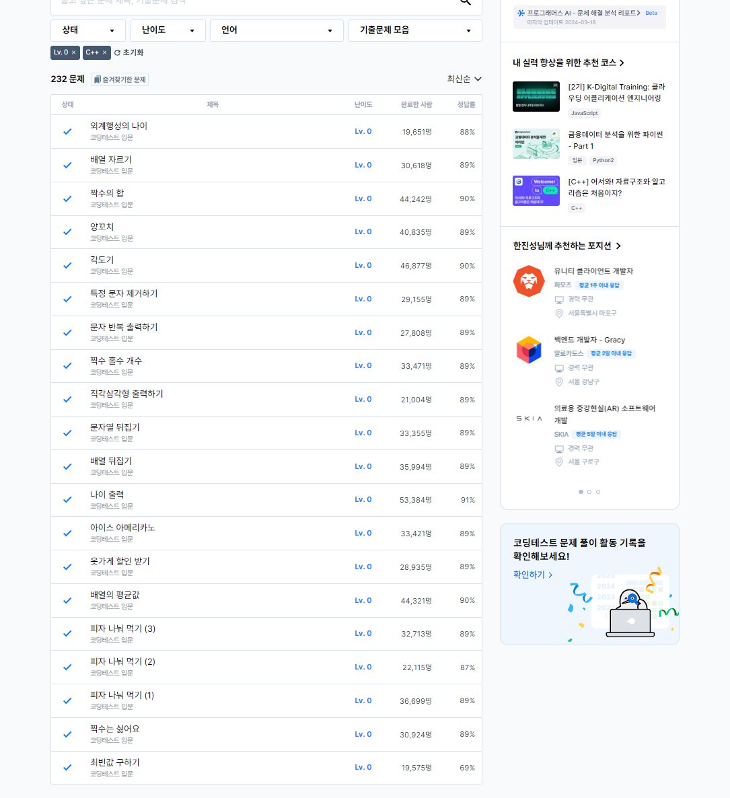
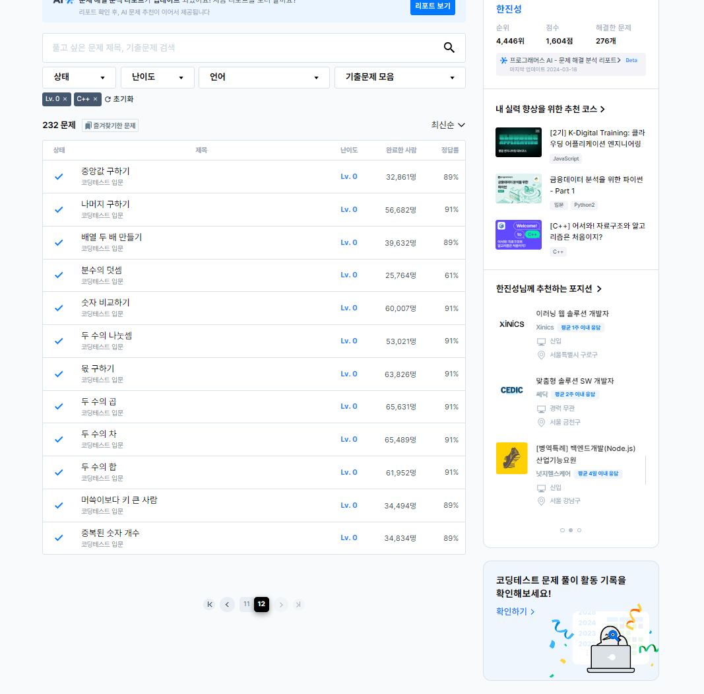

# 8일차

프로그래머스 LV0 풀이 (page10~page12)

8일차가 되어 0레벨 풀이를 모두 마쳤다.

프로그래머스 0레벨 풀이를 하며 느낀 점 : 문제 전체적으로 간단한 구성을 가진 것이 대부분이나, 일부 생각할만한 거리가 있는 문제들이 여럿 숨겨져 있었다.


### 구슬을 나누는 경우의 수
[구슬을 나누는 경우의 수](https://school.programmers.co.kr/learn/courses/30/lessons/120840)

```
#include <string>
#include <vector>

using namespace std;

int solution(int balls, int share) {
    long answer = 1;
    
    for(int i=1;i<=share;i++){
        answer = answer * (balls--);
        answer = answer / i;
    }
    
    return answer;
}
```

간단하게 nCm을 구하는 문제인데, 중간 과정에서 int 값의 범위를 넘는 값이 있어 long으로 처리해주었다. 이 문제를 가져온 이유는 질문하기의 내용에서인데. 조합의 경우의 수를 구하는 방법은 여러가지가 있을 것이다. 나처럼 곱셈과 나눗셈을 반복하며 계산 중간값을 최대한 줄이려 한 풀이도 있는 반면에, 팩토리얼을 구현하여 값이 long long으로도 처리할 수 없는 매우 큰 값이 되고, bigint 등을 사용하여 해결한 케이스도 있어 신선했다.





