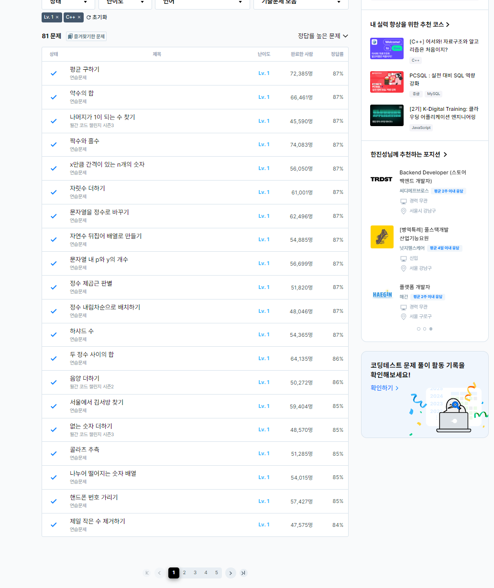
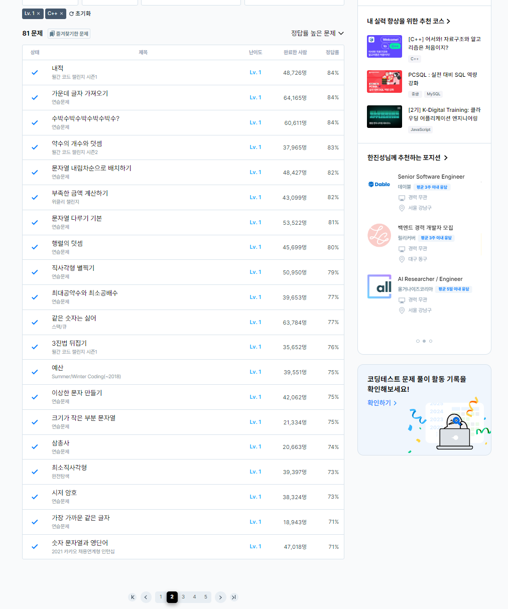

# 9일차

프로그래머스 LV1 풀이 (page1\~page2)

### 삼총사

[삼총사](https://school.programmers.co.kr/learn/courses/30/lessons/131705)

```
#include <string>
#include <vector>
using namespace std;

int numbers[3] = {0};
int answer = 0;
void combination(int start, int N, vector<int> &number, int cnt){
    
    if(cnt == 3){
        
        int sum = numbers[0] + numbers[1] + numbers[2];
        if(sum == 0){
            answer++;
        }
        return;
    }
    
    for(int i=start;i<N;i++){
        numbers[cnt] = number[i];
        combination(i + 1, N, number, cnt + 1);
    }
    
};

int solution(vector<int> number) {
    combination(0,number.size(),number, 0);
    
    
    return answer;
}
```

조합 알고리즘을 C++으로 처음 구현해 보았다.

\#예산 [예산](https://school.programmers.co.kr/learn/courses/30/lessons/12982)

```
#include <iostream>
#include <stdio.h>
#include <string>
#include <vector>
#include <algorithm>
using namespace std;

int solution(vector<int> d, int budget) {
    int answer = 0;
    
    sort(d.begin(),d.end());
    int total = d[0];
    
    if(total > budget){
        return 0;
    }else if(total == budget){
        return 1;
    }
    
    for(int i=1,n=d.size();i<n;i++){
        
        if(total > budget){
            answer = i-1;
            break;
        }else if(total == budget){
            answer = i;
            break;
        }
        total += d[i];
    }
    if(answer == 0){
        answer= d.size();
    }
    
    
    return answer;
}
```

간단한 문제이지만 그리디 알고리즘과 관련된 문제였다.




